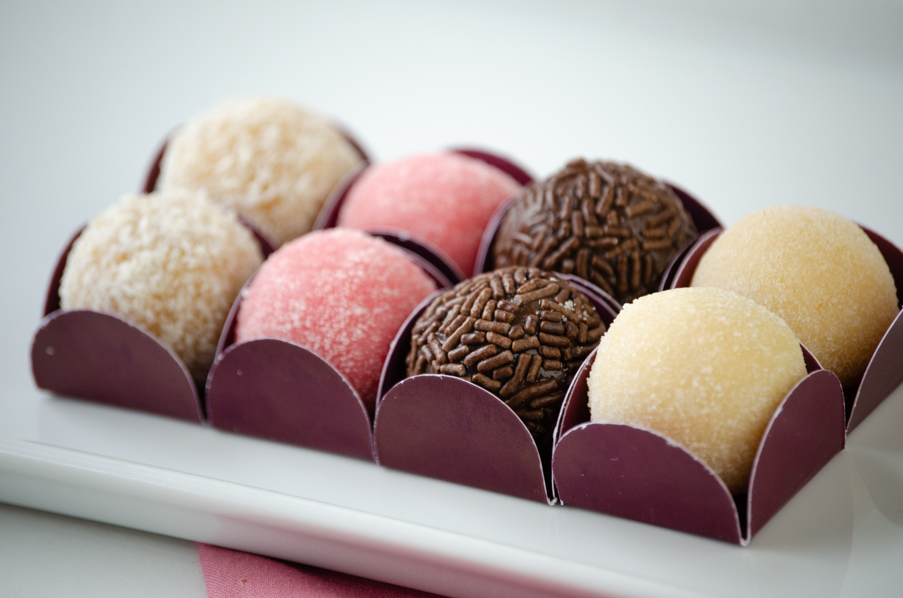

# 🍬 Docinhos de Festa



**Docinhos de Festa** é um site moderno, minimalista e responsivo desenvolvido para lojas de docinhos e doces de festa. O projeto combina HTML5, CSS3 e JavaScript para oferecer uma experiência visual agradável e funcional para os usuários, com foco em navegação intuitiva e interação dinâmica.

---

## 🛠 Tecnologias utilizadas

- **HTML5** – Estrutura semântica e moderna do site.
- **CSS3** – Layout responsivo, design minimalista e efeitos visuais suaves.
- **JavaScript** – Slider automático, navegação interativa e envio de formulário via AJAX.
- **Formcarry** – Backend simples para envio de mensagens de contato sem necessidade de servidor próprio.

---

## 🌟 Funcionalidades

- **Slider rotativo automático** com navegação por botões e setas do teclado.
- **Seção de produtos** com cards modernos mostrando os docinhos.
- **Formulário de contato** funcional com envio via Formcarry e alerta de confirmação.
- **Redes sociais integradas**: Facebook, Instagram e WhatsApp.
- **Rodapé responsivo** com informações de contato e redes sociais.
- **Design minimalista e moderno**, ideal para lojas de doces e confeitaria.
- **Compatível com dispositivos móveis** e desktop.

---

## 📂 Estrutura de arquivos


/docinhos-de-festa
│
├─ index.html # Página principal
├─ style.css # Estilos do site
├─ script.js # Slider e formulário AJAX
├─ img/ # Imagens dos docinhos e ícones de redes sociais
│ ├─ docinho1.jpg
│ ├─ docinho2.jpg
│ ├─ docinho3.jpg
│ ├─ docinho4.jpg
│ ├─ docinho5.jpg
│ ├─ docinho6.png
│ ├─ facebook.png
│ ├─ instagram.svg
│ └─ whatsapp.png
└─ README.md # Este arquivo


---

## 🚀 Como usar

1. Clone o repositório:

```bash
git clone [(https://github.com/SimpoMendes/docinhos)]
